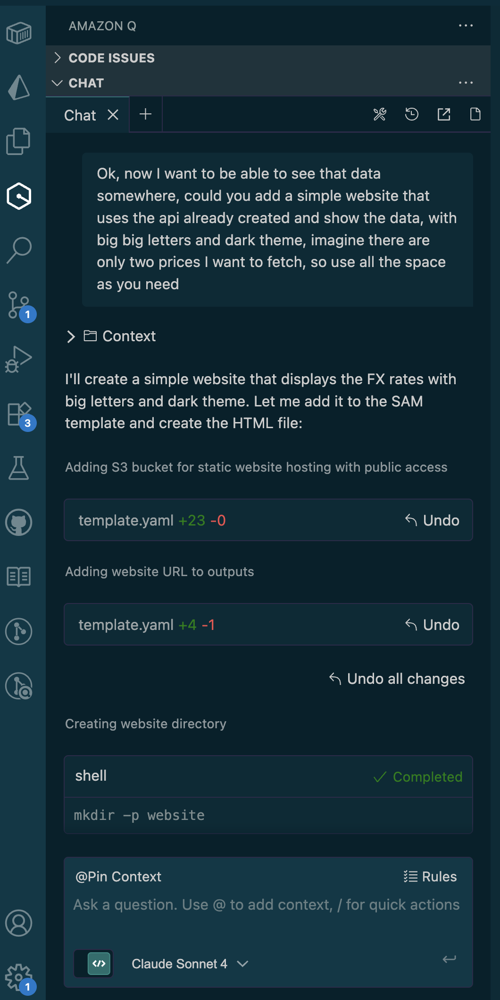

# aws-nerdearla

AWS Lambda function that fetches FX rates from CriptoYa API and stores them in NeonDB.

## Features
- Fetches USD exchange rates (MEP AL30, USDT) from CriptoYa API
- Stores rates in PostgreSQL database with upsert logic
- Built with AWS SAM for easy deployment

## Setup

1. Install dependencies:
```bash
cd src && npm install
```

2. Create local environment file:
```bash
cp env.json.example env.json
# Edit env.json with your database URL
```

3. Deploy:
```bash
sam build
sam deploy --guided --parameter-overrides DatabaseUrl="your-db-url"
```

4. Upload website and populate data:
```bash
# Upload website to S3 (replace bucket name with your output)
aws s3 cp website/index.html s3://YOUR-BUCKET-NAME/ --profile developer

# Populate initial data
aws lambda invoke --function-name YOUR-LAMBDA-FUNCTION-NAME --profile developer response.json
```

## Local Development

```bash
sam local invoke AwsNerdearlaFunction --env-vars env.json
```

## API Testing

```bash
sam build
sam local start-api --env-vars env.json
curl http://localhost:3000/fx-rates
```

## Website Testing

1. Start the API:
```bash
sam build
sam local start-api --env-vars env.json
```

2. Serve the website:
```bash
cd website
python3 -m http.server 8080
```

3. Open browser: `http://localhost:8080`

## Testing

```bash
npm test
```

## Live Dashboard

🚀 **Live FX Rates Dashboard**: http://aws-nerdearla-fxrateswebsite-vgwheehccblt.s3-website-us-east-1.amazonaws.com

## Chat with Amazon Q

This entire project was built through a conversation with Amazon Q Developer! From initial Lambda setup to database integration, API creation, website development, and rate limiting - all implemented through natural language requests.


